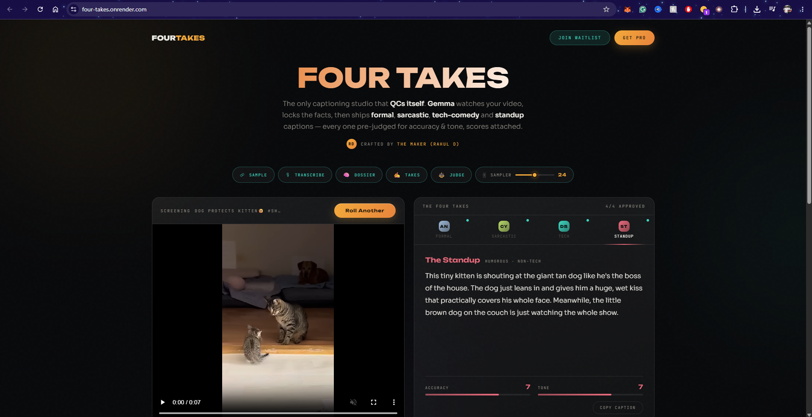

# 🎬 FOUR TAKES — AI Video Captioning Studio

*Crafted by The Maker (Rahul D)*



One clip. Four voices. A grounded, self-judging caption studio where **Gemma** (Gemma 4 31B / Gemma 3 27B — env-configurable)
(via **Fireworks AI**, running on AMD hardware) watches your video and delivers the
same facts in four unmistakable styles: **formal, sarcastic, humorous-tech, and
humorous-non-tech** — each caption scored by an internal LLM judge *before* you
ever see it.

**The only video captioning studio that QCs itself.** Every caption ships
pre-judged — an internal LLM judge scores accuracy and tone against a strict
rubric before output, and anything below 8/8 is automatically retaken. In a
market afraid of AI hallucinations in brand content, Four Takes is
**brand-safe by construction**: all four voices are written from one
facts-locked scene dossier, so they cannot contradict the video or each other.

## Why it scores well

It is judged by an LLM on **accuracy** and **tone**. Four Takes attacks both:

1. **Grounding beats hallucination.** ffmpeg samples frames uniformly across the
   FULL clip duration (start → end, so the ending is never missed) plus the
   audio track; Whisper transcribes speech; Gemma (multimodal) compiles a
   **scene dossier** — a strict facts-only JSON (subjects, actions in order,
   on-screen text). All four captions are written *from the dossier*, so every
   style agrees on the facts. Accuracy is protected by construction.
2. **Tone is calibrated, not hoped for.** Each style has a named persona,
   a voice spec, a few-shot anchor, and an explicit "avoid" list
   (e.g. non-tech humor bans *all* technical vocabulary — a common failure mode).
3. **Self-judge refinement loop.** Before output, an internal judge scores each
   caption 0–10 on accuracy and tone using a rubric that mirrors the official
   criteria. Captions below 8/8 get sent back with a concrete fix instruction —
   up to 2 retakes. The UI shows the retakes live ("⟲ passed after 1 retake").

## Architecture

```
video ─► ffmpeg uniform frames (full timeline) ──┐
      └► ffmpeg audio ─► Whisper (Fireworks)
                            │
                            ▼
              Gemma ······· SCENE DOSSIER (facts-only JSON)
                            │
        ┌──────────┬────────┼──────────┬─────────────┐
        ▼          ▼        ▼          ▼             │
     Formal    Sarcastic  Hum-Tech  Hum-NonTech      │  Gemma
        └──────────┴────────┴──────────┘             │  (styling)
                            │                        │
                            ▼                        │
              Gemma ······· LLM JUDGE  ◄─ revise ────┘
              (accuracy ≥8 AND tone ≥8, max 2 retakes)
                            │
                            ▼
                     Four approved takes
```

Every model call goes through **Fireworks AI** (`FIREWORKS_BASE_URL`), and the
whole stack is **Gemma-first** — vision, styling, and judging all on Gemma.
Models are env-configurable (`VISION_MODEL`, `STYLE_MODEL`, `JUDGE_MODEL`), so
you can run whichever Gemma generation your provider hosts — Gemma 4 31B,
Gemma 4 26B, or Gemma 3 27B. Reasoning-style outputs (Gemma 4 emits
`<thought>` blocks) are stripped automatically, so captions always come out
clean.

### Dev mode

For local testing:

```
FIREWORKS_API_KEY=AQ.your_google_ai_studio_key
FIREWORKS_BASE_URL=https://generativelanguage.googleapis.com/v1beta/openai
VISION_MODEL=models/gemma-4-31b-it
STYLE_MODEL=models/gemma-4-31b-it
JUDGE_MODEL=models/gemma-4-31b-it
```

Note: Whisper isn't available on this endpoint, so clips are treated as
silent during dev. 

```

## Configuration

| env var | default | notes |
|---|---|---|
| `FIREWORKS_API_KEY` | — | required |
| `VISION_MODEL` / `STYLE_MODEL` / `JUDGE_MODEL` | Gemma (see .env.example) | any OpenAI-compatible chat model id |
| `WHISPER_MODEL` | `whisper-v3` | Fireworks audio transcription |
| `MAX_FRAMES` | 10 | frames sampled evenly across the whole clip |
| `MAX_JUDGE_ROUNDS` | 2 | retakes per style |

## Stack

FastAPI · ffmpeg · Fireworks AI · Gemma (4 / 3) · Whisper v3 · vanilla JS
(zero frontend build step — one HTML file).

## Credits

Designed & built by **The Maker (Rahul D)** — Electroverse · Hackster.io 250+ projects.

## License

MIT
